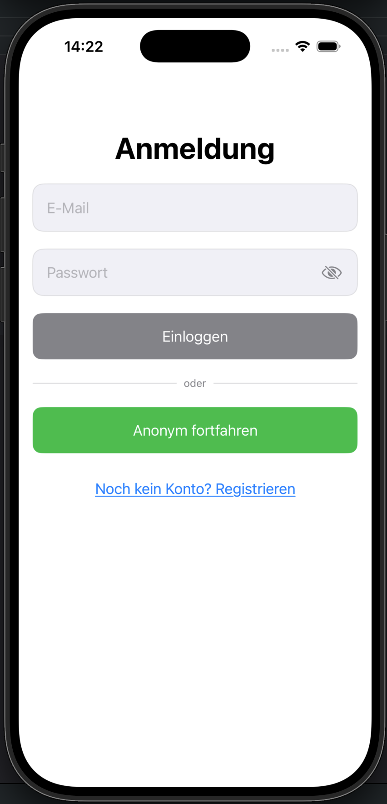
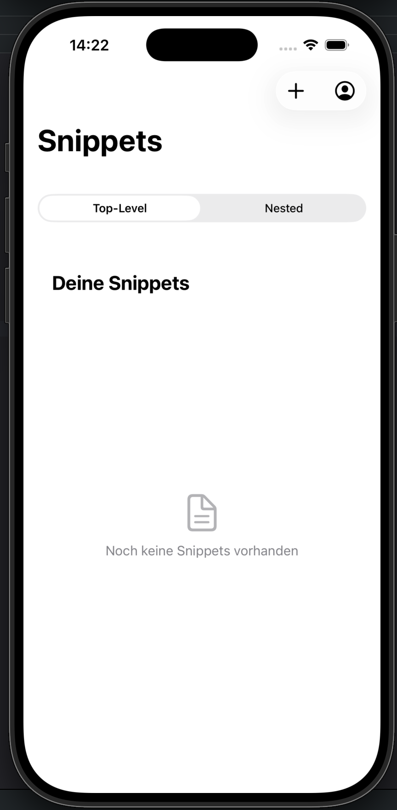
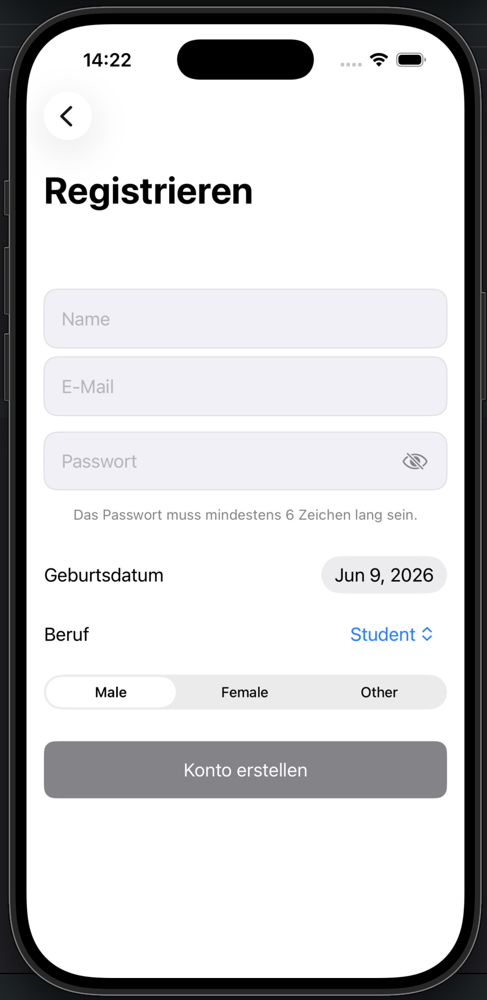
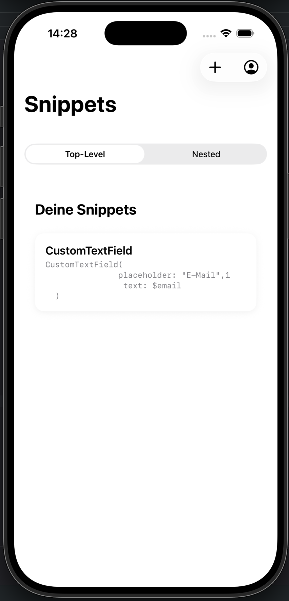
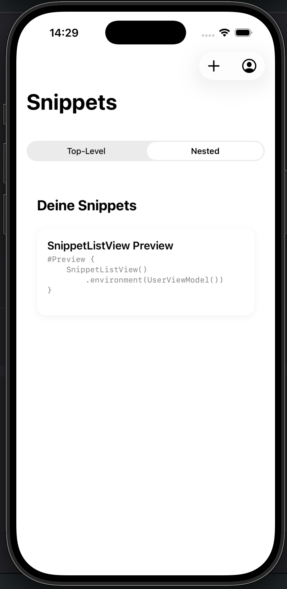
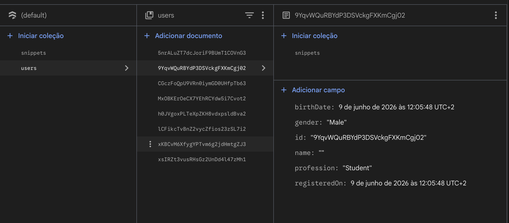
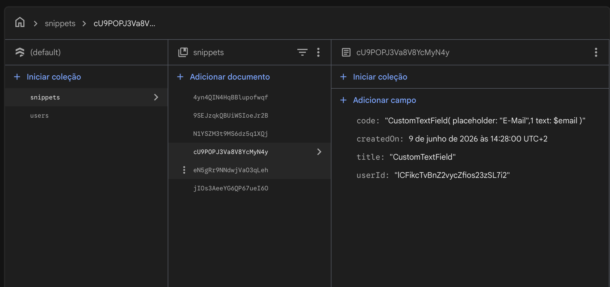
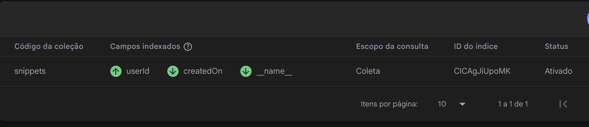

# 💻 Code Snippet App – Week 9 Project

An iOS SwiftUI application that allows users to securely store, organize, and manage code snippets using Firebase Authentication and Firestore Database.

---

<p align="left">
  
  &nbsp;
  
  &nbsp;
  
  &nbsp;
  
    &nbsp;
  
</p>

## 🧠 Project Idea

The goal of this project is to build a cloud-based code snippet manager where users can save important code fragments and access them anytime.

The application integrates Firebase Authentication and Firestore to provide secure user management and real-time data synchronization.

Users can:

* Create and save code snippets
* View all saved snippets in real time
* Delete snippets
* Register and log in using email and password
* Use anonymous authentication

---

## 🎯 Project Focus

The primary focus of this project was not the user interface, but rather the integration and architecture of Firebase services within a SwiftUI application.

Special attention was given to:

* Firebase Authentication (Anonymous and Email/Password)
* Firestore data modeling and persistence
* Realtime data synchronization using Snapshot Listeners
* User session management
* Reusable and scalable Firebase operations
* Clean MVVM architecture

To support these goals, a custom `FirebaseManager` service layer was developed to centralize all Firebase interactions and provide reusable generic CRUD operations.

The user interface was intentionally kept simple, allowing development efforts to focus on backend integration, data flow, architecture design, and Firebase best practices.

---

## 🛠️ Tech Stack

* Swift
* SwiftUI
* Xcode
* Firebase Authentication
* Firebase Firestore
* MVVM Architecture
* NavigationStack

---

## 🏗️ Architecture

* MVVM Architecture
* Centralized Firebase Service Layer
* Separation of Concerns
* Reusable Firestore CRUD Operations
* Generic Firebase Helpers

---

## 🔥 FirebaseManager

A custom `FirebaseManager` singleton was created to centralize all Firebase interactions and provide reusable abstractions for both **top-level** and **nested Firestore collections**.

### Responsibilities

* Authentication management (Anonymous & Email/Password)
* User creation and retrieval
* Firestore CRUD operations
* Realtime Firestore listeners
* Generic document creation and fetching
* Top-level collection support (`collection/{documentId}`)
* Nested collection support (`users/{userId}/subcollection/{documentId}`)
* Snippet management helpers
* Generic delete operations for both collection structures

### Firestore Architecture

The manager supports two Firestore data modeling approaches:

#### Top-Level Collections

Useful for globally accessible data.

```text
snippets/{snippetId}
```

#### Nested Collections

Useful for user-scoped data.

```text
users/{userId}/snippets/{snippetId}
```

This flexibility allows the application to store and retrieve data using the most appropriate Firestore structure depending on the use case.

<p align="left">
  
  &nbsp;
  
  &nbsp;
  
</p>

### Benefits

* Reduces code duplication
* Keeps ViewModels clean and focused
* Centralizes Firebase logic in a single layer
* Supports both top-level and nested Firestore architectures
* Provides reusable generic CRUD operations
* Simplifies realtime data synchronization
* Improves scalability and maintainability

## ⚙️ Setup & Requirements

Before running the project, make sure to configure Firebase properly.

### 🔥 Firebase Configuration

This app requires a valid Firebase configuration file to run.

You must add your own:

```text
GoogleService-Info.plist
```

---

## 🧱 Project Structure

### Models

* FireUser.swift
* FireSnippet.swift

### Services

* FirebaseManager.swift

### ViewModels

* UserViewModel.swift
* SnippetViewModel.swift

### Views

* LoginView.swift
* RegisterView.swift
* SnippetListView.swift
* AddSnippetView.swift

---

## ⚙️ Features

### 🔐 Authentication

* Anonymous login
* Email & password registration
* Email & password login
* Persistent login sessions
* Secure Firebase Authentication integration
* Logout functionality

---

### 👤 User Management

Users can store additional profile information:

* Name
* Birth date
* Gender
* Profession

All user data is stored inside Firestore.

---

### 💻 Code Snippets

* Create new code snippets
* Store title and code content
* Save snippets in Firestore
* Real-time synchronization
* Delete snippets with swipe actions
* Automatic UI updates using Firestore listeners

---

### ☁️ Firebase Integration

#### Firebase Authentication

* Anonymous authentication
* Email & password authentication
* Session persistence

#### Firestore Database

* Store users
* Store snippets
* Realtime listeners
* Generic CRUD operations
* Nested document collections

---

## 📋 Snippet Management

### Add Snippet

* Create new snippets
* Save instantly to Firestore
* Associate snippets with the authenticated user

### Snippet List

* View all personal snippets
* Real-time updates
* Organized display

### Delete Snippets

* Swipe-to-delete support
* Confirmation alerts
* Automatic synchronization

---

## 📚 Concepts Practiced

* SwiftUI Navigation
* Firebase Authentication
* Firestore Database
* Firestore Snapshot Listeners
* CRUD Operations
* MVVM Architecture
* Service Layer Pattern
* Singleton Pattern
* Generic Functions
* User Session Management
* Cloud Data Storage
* Codable Models
* Error Handling
* State Management
* Observable Objects

---

## 🚀 Learning Goals

This project was created to practice:

* Integrating Firebase into an iOS application
* Building authentication flows
* Managing cloud-based data
* Working with Firestore listeners
* Implementing MVVM architecture
* Creating reusable Firebase services
* Structuring scalable SwiftUI applications

---

## 🌟 Additional Features

Features implemented beyond the basic requirements:

* Anonymous authentication
* User profile storage
* Real-time Firestore synchronization
* Persistent login sessions
* Custom FirebaseManager service layer
* Generic Firestore CRUD helpers

---

## 👨‍💻 Author

Developed as part of the Syntax Institute iOS Development Program using SwiftUI, Firebase Authentication, Firestore, and MVVM architecture.
